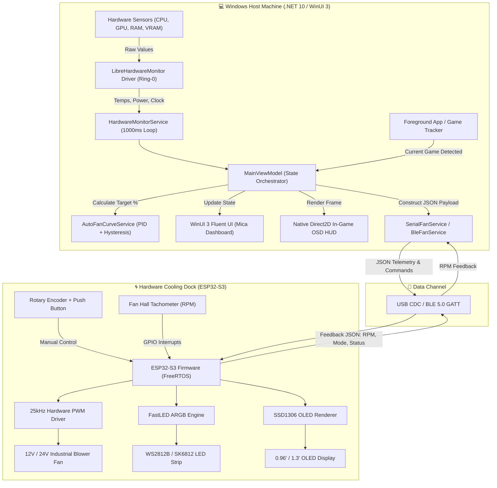

# 🌀 Smart Fan Cooling Ecosystem - Windows Native App & ESP32-S3 Firmware

<div align="center">

[-0078D4?style=for-the-badge&logo=windows&logoColor=white)](https://microsoft.com)
[](https://dotnet.microsoft.com/)
[](https://learn.microsoft.com/windows/apps/winui/winui3/)
[](https://www.espressif.com/)
[](https://platformio.org/)
[](#-giao-thức-truyền-thông--connectivity)
[](LICENSE)

<p align="center">
  <b>Hệ sinh thái điều khiển tản nhiệt thông minh và giám sát phần cứng chuyên sâu thế hệ mới.</b><br>
  <i>Kết hợp sức mạnh giữa ứng dụng Windows Native hiệu năng cao (WinUI 3 / C# 13 / .NET 10) và bộ điều khiển nhúng vi xử lý kép ESP32-S3 qua USB Type-C High-Speed & BLE 5.0 không dây.</i>
</p>

---

</div>

## 📖 Mục Lục

- [🌟 Giới Thiệu Tổng Quan](#-giới-thiệu-tổng-quan)
- [🔥 Công Nghệ Sử Dụng (Tech Stack Showcase)](#-công-nghệ-sử-dụng-tech-stack-showcase)
- [🏛️ Kiến Trúc Hệ Thống (System Architecture)](#️-kiến-trúc-hệ-thống-system-architecture)
- [⚡ Tính Năng Nổi Bật (Key Features)](#-tính-năng-nổi-bật-key-features)
- [🔌 Giao Thức Truyền Thông & Connectivity](#-giao-thức-truyền-thông--connectivity)
- [📂 Cấu Trúc Mã Nguồn (Project Structure)](#-cấu-trúc-mã-nguồn-project-structure)
- [🚀 Hướng Dẫn Cài Đặt & Triển Khai (Quick Start)](#-hướng-dẫn-cài-đặt--triển-khai-quick-start)
- [🔌 Sơ Đồ Phần Cứng (Hardware Pinout)](#-sơ-đồ-phần-cứng-hardware-pinout)
- [🛡️ Cơ Chế An Toàn & Watchdog (Fail-Safe)](#️-cơ-chế-an-toàn--watchdog-fail-safe)

---

## 🌟 Giới Thiệu Tổng Quan

**Smart Fan Cooling System** là giải pháp phần cứng + phần mềm toàn diện dành cho các đế tản nhiệt laptop công suất cao (Llano, IETS, Flydigi, Custom DIY) và hệ thống tản nhiệt PC ngoài. Dự án xóa bỏ giới hạn của các tản nhiệt truyền thống vốn chỉ chỉnh tốc thủ công bằng núm vặn cơ học đơn giản.

### 🎯 Bài Toán & Giải Pháp
- **Vấn đề**: Người dùng chơi game hoặc làm tác vụ nặng (Render, AI, Compile) khiến CPU/GPU nóng đột ngột nhưng quạt tản nhiệt ngoài không tự tăng tốc kịp thời, hoặc quạt quay tối đa gây ồn ào khi chỉ lướt web.
- **Giải pháp của Smart Fan Cooling**: 
  1. Trích xuất trực tiếp dữ liệu cảm biến phần cứng (Nhiệt độ Package/Core/Hotspot, Xung nhịp, Công suất tiêu thụ Watt) ở mức Ring-0 độ trễ dưới 10ms.
  2. Tự động tính toán đường cong điều tốc (Auto Fan Curve) với thuật toán Hysteresis chống sốc vòng tua quạt.
  3. Truyền dữ liệu telemetry xuống vi điều khiển **ESP32-S3** để điều khiển quạt phản lực chuẩn công nghiệp 4-pin PWM 25kHz, đồng thời render thông số sống động lên màn hình OLED và dải LED ARGB.
  4. Hiển thị In-Game OSD HUD nổi trên màn hình game giúp theo dõi nhiệt độ và RPM mà không cần bật MSI Afterburner.

---

## 🔥 Công Nghệ Sử Dụng (Tech Stack Showcase)

Dự án được xây dựng với những công nghệ hiện đại nhất ở cả tầng Desktop Application và Tầng Firmware nhúng:

```
┌────────────────────────────────────────────────────────────────────────────────────────┐
│                                 WINDOWS DESKTOP CLIENT                                 │
│  ┌─────────────────────────┐  ┌─────────────────────────┐  ┌────────────────────────┐  │
│  │   WinUI 3 / XAML        │  │     .NET 10 / C# 13     │  │ CommunityToolkit.Mvvm  │  │
│  │ Fluent Design v2 + Mica │  │ High Performance Runtime│  │ Source Generators MVVM │  │
│  └─────────────────────────┘  └─────────────────────────┘  └────────────────────────┘  │
│  ┌─────────────────────────┐  ┌─────────────────────────┐  ┌────────────────────────┐  │
│  │ LibreHardwareMonitorLib │  │ Direct2D / Win32 GDI    │  │ Windows.Devices.BLE    │  │
│  │ Ring-0 Kernel Telemetry │  │ Zero-Lag In-Game OSD    │  │ Native Bluetooth 5.0   │  │
│  └─────────────────────────┘  └─────────────────────────┘  └────────────────────────┘  │
└───────────────────────────────────────────┬────────────────────────────────────────────┘
                                            │ Dual-Mode Stream (USB CDC / BLE 5.0)
┌───────────────────────────────────────────▼────────────────────────────────────────────┐
│                             EMBEDDED HARDWARE (ESP32-S3)                               │
│  ┌─────────────────────────┐  ┌─────────────────────────┐  ┌────────────────────────┐  │
│  │ ESP32-S3 Dual-Core      │  │ PlatformIO + C++20      │  │ Hardware PWM 25kHz     │  │
│  │ 240MHz Xtensa LX7 MCU   │  │ FreeRTOS Multitasking   │  │ Intel 4-Pin Fan Spec   │  │
│  └─────────────────────────┘  └─────────────────────────┘  └────────────────────────┘  │
│  ┌─────────────────────────┐  ┌─────────────────────────┐  ┌────────────────────────┐  │
│  │ SSD1306 / SH1106 OLED   │  │ FastLED / RMT Engine    │  │ Tachometer Interrupt   │  │
│  │ I2C Dynamic Telemetry   │  │ WS2812B/SK6812 ARGB     │  │ Precise RPM Capture    │  │
│  └─────────────────────────┘  └─────────────────────────┘  └────────────────────────┘  │
└────────────────────────────────────────────────────────────────────────────────────────┘
```

### 1. Windows Native Client Stack
- **Framework & UI**: **WinUI 3** kết hợp **Windows App SDK**, áp dụng ngôn ngữ thiết kế **Fluent Design System v2** với hiệu ứng kính mờ **Mica Alt Backdrop**, Acrylic brushes, hiệu ứng chuyển động mượt mà 120Hz+.
- **Ngôn ngữ & Runtime**: **C# 13** chạy trên nền **.NET 10**, tối ưu hóa cấu trúc bộ nhớ Zero-Allocation, hỗ trợ ReadyToRun (R2R) / Native AOT.
- **Kiến trúc Mã nguồn**: **MVVM (Model-View-ViewModel)** chuẩn mực với `CommunityToolkit.Mvvm`, tận dụng C# Source Generators (`[ObservableProperty]`, `[RelayCommand]`), phân tách ViewModel thành các module chức năng độc lập (Connectivity, FanControl, OledCanvas, OsdHud, Rgb, Sensors, Telemetry, AppProfiles).
- **Trích xuất Cảm biến Phần cứng**: Tích hợp `LibreHardwareMonitorLib` truy vấn trực tiếp driver nhân (Ring-0 Kernel Driver), hỗ trợ đầy đủ tất cả CPU Intel Core Ultra / 14th/13th Gen, AMD Ryzen 7000/8000/9000 series, GPU NVIDIA GeForce RTX 40/50 series, AMD Radeon RX 7000 series, Intel Arc.
- **Direct2D Hardware-Accelerated OSD Overlay**: Overlay hiển thị chỉ số trong game và ngoài desktop bằng Native Win32 Layered Window kết hợp DirectWrite, tiêu thụ CPU < 0.1%, hoàn toàn không làm tụt FPS khi chơi game eSports / AAA.

### 2. Embedded Firmware Stack (ESP32-S3)
- **Vi xử lý**: **ESP32-S3-WROOM-1** (Dual-Core 32-bit Xtensa LX7 up to 240MHz, 8MB Flash, 512KB SRAM, AI Vector instructions).
- **Môi trường phát triển**: **PlatformIO Core / IDE** trên nền tảng **C++20** hiện đại, quản lý tác vụ bất đồng bộ bằng **FreeRTOS**.
- **Điều khiển Quạt 25kHz High-Frequency PWM**: Sử dụng ESP32 LEDC hardware timer phát xung PWM tần số chính xác 25kHz chuẩn Intel 4-Pin Fan Specification, loại bỏ hoàn toàn tiếng rít cuộn cảm (Coil Whine) ở mọi dải tốc độ.
- **Đo Tốc Độ Vòng Quay Quạt (Tachometer)**: Bắt ngắt phần cứng (Hardware GPIO Interrupts) từ cảm biến Hall của quạt, tính toán RPM tức thời với bộ lọc trung bình động làm mịn dữ liệu.
- **Giao tiếp Đa Kênh (Tri-Mode Comm)**:
  - **USB Serial CDC (High-Speed)**: Tốc độ Baud 115200 bps qua cổng Type-C Native USB OTG.
  - **Bluetooth Low Energy 5.0 (BLE GATT)**: Tự động phát quảng bá (BLE Advertising) và truyền nhận packet nhị phân/JSON hai chiều cực tiết kiệm năng lượng.
  - **Wi-Fi WebSockets / OTA**: Sẵn sàng nâng cấp firmware không dây (Over-The-Air) và điều khiển qua mạng nội bộ.
- **Màn hình OLED 0.96"/1.3" (SSD1306/SH1106)**: I2C Fast-Mode 400kHz, hiển thị đồ họa đo nhiệt độ, tốc độ RPM quạt, thanh bar phần trăm, icon trạng thái kết nối.
- **Dải LED ARGB Đa Hiệu Ứng**: Thư viện FastLED điều khiển WS2812B/SK6812 với pipeline màu 24-bit sắc nét, hiệu ứng đồng bộ nhiệt độ phần cứng (Thermal Reactive), Rainbow Wave, Breathing, Speed Pulse.
- **Rotary Encoder tương tác vật lý**: Hỗ trợ núm xoay vô cực có nút nhấn (Push-button) để chuyển profile và tăng giảm tốc độ trực tiếp trên đế tản nhiệt.

---

## 🏛️ Kiến Trúc Hệ Thống (System Architecture)

Luồng trao đổi dữ liệu hai chiều giữa Máy tính Windows và Phần cứng ESP32-S3:



---

## ⚡ Tính Năng Nổi Bật (Key Features)

| Tính Năng | Mô Tả Kỹ Thuật |
| :--- | :--- |
| **📊 Real-Time Telemetry Matrix** | Giám sát chi tiết CPU Package, Core Max, GPU Core, GPU Hotspot, GPU Memory, Công suất tiêu thụ (Watt), Xung nhịp (GHz) và Tải sử dụng (%). |
| **🌀 Smart Fan Curve Engine** | Tự động tăng giảm tốc độ quạt dựa trên nhiệt độ theo 4 Profile chuẩn: `Quiet` (Êm ái), `Balanced` (Cân bằng), `Turbo` (Hiệu năng cực đại), và `Custom` (Tùy chỉnh điểm nhiệt theo ý muốn). |
| **🛡️ Hysteresis Temperature Smoothing** | Thuật toán trễ nhiệt độ thông minh giúp quạt không bị rồ ga / giật tốc độ liên tục khi CPU tăng giảm nhiệt độ tức thời trong vài giây. |
| **🎮 Auto App/Game Profiles** | Tự động quét tiến trình game/ứng dụng đang chạy trên màn hình (Foreground Window). Ví dụ: Mở game nặng tự chuyển sang chế độ **Turbo** + **LED Đỏ rực**, thoát game về lướt web tự chuyển sang **Quiet** + **LED Xanh êm dịu**. |
| **🖥️ Native Direct2D OSD HUD** | Hiển thị thông số CPU/GPU/RPM nổi góc màn hình hoặc In-game với giao diện trong suốt hiện đại, tùy chỉnh kích thước, vị trí và màu sắc linh hoạt. |
| **📺 OLED Display Canvas Studio** | Render thông số phần cứng, thanh bar đồ thị, icon trạng thái lên màn hình OLED 128x64 gắn trên dock tản nhiệt theo thời gian thực. |
| **🌈 Dynamic ARGB Lighting Sync** | Hỗ trợ hơn 6 chế độ LED: `Thermal Reactive` (Đổi màu theo nhiệt độ CPU/GPU), `Speed Pulse` (Chớp theo tốc độ vòng quay quạt), `Rainbow Wave`, `Breathing`, `Static`, `Audio Sync`. |
| **🎛️ Dual-Control (Software + Hardware)** | Điều khiển linh hoạt từ giao diện WinUI 3 hoặc vặn núm xoay **Rotary Encoder** vật lý trực tiếp trên dock tản nhiệt. Hai chiều được đồng bộ hoàn toàn. |
| **🔄 Auto COM Port Discovery** | Tự động phát hiện cổng COM USB Serial của vi điều khiển khi cắm vào máy tính, tự động kết nối lại (Auto-Reconnect) khi rút cắm dây cáp. |

---

## 🔌 Giao Thức Truyền Thông & Connectivity

Hệ thống giao tiếp hai chiều thông qua cấu trúc gói tin JSON tối ưu hóa băng thông truyền dữ liệu:

### 1. Máy Tính Gửi Xuống ESP32-S3 (Host Command Packet)
```json
{
  "mode": "auto",
  "manual_pwm": 75,
  "cpu_temp": 68.5,
  "gpu_temp": 72.0,
  "cpu_power": 45.2,
  "gpu_power": 115.0,
  "rgb_mode": 3,
  "rgb_color": [0, 215, 255],
  "rgb_speed": 50,
  "rgb_brightness": 180
}
```

### 2. ESP32-S3 Phản Hồi Lên Máy Tính (Hardware Telemetry Packet)
```json
{
  "rpm": 3250,
  "pwm_actual": 75,
  "dock_temp": 31.2,
  "current_mode": "auto",
  "encoder_pos": 75,
  "status": "OK",
  "watchdog": "alive"
}
```

---

## 📂 Cấu Trúc Mã Nguồn (Project Structure)

```
smart_fan_cooling_windows_app/
│
├── App.xaml / App.xaml.cs                 # WinUI 3 Application Entry Point & Theme Management
├── MainWindow.xaml / MainWindow.xaml.cs   # Fluent Design Main Window & UI Shell
├── app.manifest                           # DPI Awareness (PerMonitorV2) & Admin Privilege Elevation
├── smart_fan_cooling_windows_app.csproj   # .NET 10 Project Config & Dependencies
│
├── Converters/                            # XAML Binding Value Converters
│   └── ValueConverters.cs                 # Boolean, Visibility, String & Color Converters
│
├── Models/                                # Domain Data Models
│   ├── FanProfile.cs                      # Profile Fan Curve Data Points
│   └── HardwareTelemetry.cs               # Sensor Snapshot Data Model
│
├── Services/                              # Core Business & Infrastructure Services
│   ├── AppSettingsService.cs              # JSON Persistent User Settings
│   ├── ProcessPriorityService.cs          # Background Process Optimization
│   ├── StartupService.cs                  # Windows Startup Registration (Registry)
│   ├── Communication/                     # Hardware Transceiver Layer
│   │   ├── SerialFanService.cs            # High-Speed USB Serial CDC Driver (COM Port)
│   │   └── BleFanService.cs               # Bluetooth Low Energy 5.0 GATT Client
│   ├── FanControl/                        # Intelligent Fan Regulation
│   │   └── AutoFanCurveService.cs         # Polynomial & Linear Fan Curve Interpolation
│   ├── Hardware/                          # Sensor Acquisition
│   │   └── HardwareMonitorService.cs      # Ring-0 Kernel Telemetry (LibreHardwareMonitor)
│   ├── Oled/                              # Display Graphics Pipeline
│   │   └── OledCanvasService.cs           # Frame Buffer & 128x64 Bitmap Protocol
│   └── Overlay/                           # In-Game Heads Up Display
│       └── NativeOsdOverlay.cs            # Direct2D / Win32 Transparent OSD HUD
│
├── ViewModels/                            # MVVM State Orchestration Layer
│   ├── MainViewModel.cs                   # Primary ViewModel Coordinator & Timers
│   └── Partials/                          # Modular Partial ViewModels
│       ├── MainViewModel.AppProfiles.cs   # Game/App Auto Detection & Profile Switcher
│       ├── MainViewModel.Connectivity.cs  # USB/BLE Port Scanning & State Machine
│       ├── MainViewModel.FanControl.cs    # Fan Curves, PWM Slider & Manual Override
│       ├── MainViewModel.GpioTest.cs      # Hardware Diagnostic Tools
│       ├── MainViewModel.OledCanvas.cs    # OLED Custom Screen Layout Designer
│       ├── MainViewModel.OsdHud.cs        # In-Game OSD Configuration & Styling
│       ├── MainViewModel.Rgb.cs           # ARGB Effects & Color Palettes
│       ├── MainViewModel.Sensors.cs       # Sensor Readings & Min/Max Tracking
│       └── MainViewModel.Telemetry.cs     # Realtime RPM Stream & Status
│
├── docs/                                  # Chi tiết tài liệu kỹ thuật
│   ├── WINUI3_PROJECT_CODE.md             # Tổng hợp chi tiết mã nguồn C# WinUI 3
│   ├── WIRING_GUIDE.md                    # Hướng dẫn đấu nối 31 chân linh kiện phần cứng
│   └── wiring_diagram_dual_power.html     # Sơ đồ mạch điện tương tác trực quan (Dual Power)
│
└── firmware/smart_fan_firmware/           # ESP32-S3 Firmware (PlatformIO / C++20)
    ├── platformio.ini                     # PlatformIO Environment & Build Config
    ├── config.h                           # Pinouts, Frequencies & Threshold Constants
    ├── smart_fan_firmware.ino             # Main Setup & FreeRTOS Dual-Core Tasks Loop
    ├── fan_controller.cpp/.h              # 25kHz PWM Driver & Tachometer Interrupts
    ├── led_effects.cpp/.h                 # FastLED WS2812B/SK6812 ARGB Engine
    ├── oled_display.cpp/.h                # SSD1306/SH1106 I2C Screen Graphics Engine
    ├── encoder_input.cpp/.h               # Rotary Encoder Signal Processing & Debounce
    ├── usb_serial_service.cpp/.h          # USB CDC Serial JSON Transceiver
    ├── ble_service.cpp/.h                 # Bluetooth LE GATT Server
    └── wifi_service.cpp/.h                # Wi-Fi WebSocket & OTA Update Engine
```

---

## 🚀 Hướng Dẫn Cài Đặt & Triển Khai (Quick Start)

### 1. Yêu Cầu Môi Trường (System Requirements)
- **Hệ điều hành**: Windows 10 (Build 19041 trở lên) hoặc Windows 11 (64-bit).
- **Quyền hạn**: Chạy ứng dụng dưới quyền **Administrator** (Bắt buộc để `LibreHardwareMonitorLib` nạp Ring-0 driver đọc nhiệt độ CPU/GPU).
- **Bộ công cụ phát triển**:
  - [.NET 10 SDK](https://dotnet.microsoft.com/download)
  - [Visual Studio 2022](https://visualstudio.microsoft.com/) (Version 17.8+) với workload `.NET Desktop Development` và `Windows App SDK C# Tools`.
  - [PlatformIO Core / VS Code Extension](https://platformio.org/) (Nếu muốn nạp firmware cho ESP32-S3).

### 2. Biên Dịch & Chạy Ứng Dụng Windows
Mở **PowerShell (Run as Administrator)** tại thư mục gốc của dự án:

```powershell
# 1. Khôi phục các thư viện NuGet
dotnet restore

# 2. Biên dịch ứng dụng ở chế độ Release x64
dotnet build -c Release -r win-x64 --no-self-contained

# 3. Khởi chạy ứng dụng
dotnet run -c Release --no-build
```

Hoặc mở file [`smart_fan_cooling_windows_app.csproj`](file:///c:/Users/quan/Documents/smart_fan_cooling_windows_app/smart_fan_cooling_windows_app.csproj) trực tiếp trong Visual Studio 2022 và bấm `F5`.

### 3. Nạp Firmware Cho ESP32-S3
Mở thư mục `firmware/smart_fan_firmware` bằng VS Code đã cài PlatformIO:

```bash
# Di chuyển vào thư mục firmware
cd firmware/smart_fan_firmware

# Biên dịch mã nguồn firmware C++20
pio run

# Nạp firmware vào bo mạch ESP32-S3 qua cổng Type-C
pio run --target upload

# Mở Serial Monitor theo dõi log
pio device monitor -b 115200
```

---

## 🔌 Sơ Đồ Phần Cứng (Hardware Pinout)

Hệ thống hỗ trợ kết nối vi điều khiển **ESP32-S3** với các linh kiện ngoại vi thông qua sơ đồ chân tối ưu:

| Linh Kiện | Chân ESP32-S3 | Chức Năng Kỹ Thuật | Ghi Chú |
| :--- | :--- | :--- | :--- |
| **Quạt 4-Pin PWM** | `GPIO 4` | Xung điều tốc 25kHz PWM | Tương thích chuẩn Intel 4-Pin |
| **Quạt 4-Pin TACH** | `GPIO 5` | Ngắt bắt xung Hall Sensor (RPM) | Kèm điện trở kéo lên 10kΩ Pull-up |
| **Màn hình OLED (SDA)** | `GPIO 8` | I2C Data Line (400kHz) | Màn hình 0.96" hoặc 1.3" I2C |
| **Màn hình OLED (SCL)** | `GPIO 9` | I2C Clock Line (400kHz) | Chuẩn giao tiếp I2C SSD1306/SH1106 |
| **Dải LED ARGB (DATA)** | `GPIO 10` | FastLED RMT Timing Signal | Hỗ trợ WS2812B / SK6812 5V |
| **Rotary Encoder (CLK/A)** | `GPIO 1` | Kênh xung pha A | Phần cứng chống rung tín hiệu |
| **Rotary Encoder (DT/B)** | `GPIO 2` | Kênh xung pha B | Xác định chiều xoay (Trái/Phải) |
| **Rotary Encoder (SW)** | `GPIO 3` | Nút nhấn Push-Button | Bấm đổi mode hoặc bật tắt quạt |

> 📖 Xem hướng dẫn đấu nối chi tiết tại [WIRING_GUIDE.md](file:///c:/Users/quan/Documents/smart_fan_cooling_windows_app/docs/WIRING_GUIDE.md) và sơ đồ mạch điện trực quan [wiring_diagram_dual_power.html](file:///c:/Users/quan/Documents/smart_fan_cooling_windows_app/docs/wiring_diagram_dual_power.html).

---

## 🛡️ Cơ Chế An Toàn & Watchdog (Fail-Safe)

Để bảo vệ an toàn tuyệt đối cho phần cứng máy tính và quạt tản nhiệt:
1. **Software Emergency Overheat Trigger**: Khi nhiệt độ CPU hoặc GPU vượt ngưỡng nguy hiểm (>85°C), ứng dụng tự động bỏ qua profile hiện tại và kích hoạt tốc độ quạt **100% PWM Turbo** ngay lập tức.
2. **Hardware Watchdog Timer**: Nếu máy tính bị đơ (freeze), ngắt kết nối đột ngột hoặc tắt máy mà không đóng ứng dụng, firmware ESP32-S3 sẽ phát hiện sau 5 giây không nhận được gói tin telemetry và tự động đưa quạt về chế độ an toàn mặc định (50% PWM) để không làm nóng laptop.
3. **Soft-Start & Kick-Start Algorithm**: Khi khởi động từ 0% lên tốc độ thấp, vi điều khiển cấp một xung kích dòng ngắn 100ms giúp quạt thắng ma sát tĩnh của vòng bi, sau đó êm ái hạ về mức PWM mong muốn.

---

## 📄 License & Credits

Dự án được phát hành theo giấy phép mã nguồn mở [MIT License](LICENSE).

- **Tác giả**: Minh Quan ([@minh-quann](https://github.com/minh-quann))
- **Thư viện bên thứ ba**:
  - [LibreHardwareMonitor](https://github.com/LibreHardwareMonitor/LibreHardwareMonitor) - Hardware Monitoring Library.
  - [CommunityToolkit.Mvvm](https://github.com/CommunityToolkit/dotnet) - Microsoft MVVM Source Generators.
  - [FastLED](https://github.com/FastLED/FastLED) - LED Animation Engine for ESP32.
  - [U8g2 / Adafruit SSD1306](https://github.com/olikraus/u8g2) - Microcontroller Graphics Library.

---

<div align="center">
  <b>⭐ Đừng quên tặng một ngôi sao Star nếu dự án hữu ích với bạn! ⭐</b>
</div>
