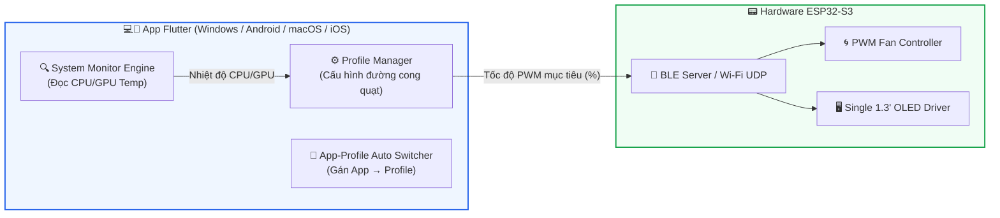

# 🛠️ TÀI LIỆU HƯỚNG DẪN HỆ THỐNG ĐIỀU KHIỂN QUẠT LLANO SMART (DUAL OLED MODE)

Tài liệu thiết kế toàn diện cho hệ thống điều khiển quạt tản nhiệt Laptop Llano Smart (Phiên bản **Dual OLED - 31 Dây**), bao gồm: **Sơ đồ đấu nối phần cứng hoàn chỉnh**, **Kiến trúc Firmware ESP32-S3 (Arduino/ESP-IDF)** và **Ứng dụng điều khiển đa nền tảng (Flutter)**.

---

## 📌 1. Danh Sách Linh Kiện & Bảng Tra Cứu Chân Cắm (Pinout Mapping)

### 🔌 Danh Sách Linh Kiện Hệ Thống

1. **Board điều khiển trung tâm:** YD-ESP32-S3 (N16R8) + Bo Đế Mở Rộng 44-Pin Terminal Adapter.
2. **Nguồn cấp chính:** Củ Nguồn Adapter Llano 12V / 3A (36W).
3. **Bộ hạ áp & Phân phối nguồn:** Mạch hạ áp **XY3606** (12V → 5.2V / 5A, tích hợp Jack DC 5.5mm, nguồn 12V đấu trực tiếp).
4. **Khối công suất điều tốc:** Module Dual MOSFET (HW-517).
5. **Khối cách ly đếm xung:** Module Opto PC817 (3V-5V).
6. **Khối hiển thị & Thao tác chính:**
   - 🖥️ **Màn hình chính: OLED 1.3" + Con lăn Encoder + 2 Nút bấm tích hợp (CON, BAK):** Hiển thị thông số Nhiệt độ Laptop/Hệ thống, Tốc độ Quạt (RPM & % PWM), Chế độ LED; cho phép xoay núm chỉnh tốc độ, ấn núm PSH Bật/Tắt quạt, ấn nút CON Bật/Tắt LED, ấn nút BAK Đổi mode LED.
   - 🖥️ **Màn hình phụ: OLED 0.96" 4-Pin (I2C2):** Hiển thị thông số phụ / trạng thái kết nối hệ thống.
7. **Khối hiệu ứng:** Dải LED RGB 3 dây (WS2812B / FastLED).

---

### 📋 Bảng Tra Cứu Chân Cắm Chi Tiết 31 Dây (Pinout Mapping Table)

| Module / Linh kiện | Chân trên Module | Chân kết nối trên Bo Đế ESP32-S3 (44-Pin) | STT Dây | Ghi chú & Chức năng |
| :--- | :--- | :--- | :--- | :--- |
| **Adapter 12V Llano** | Jack DC 5.5mm Đực | Cắm thẳng vào Jack DC 5.5mm Cái **XY3606** | **Dây 1** | Nguồn tổng 12V hệ thống |
| **Mạch Hạ Áp XY3606** | `🔴 VIN +` (Input 12V) | `🔴 VIN +` của Module MOSFET HW-517 | **Dây 2** | Nguồn 12V đấu TRỰC TIẾP sang MOSFET |
| | `⚫ VIN −` (Input GND) | `GND 2` (Cọc Trái Dưới 1) | **Dây 3** | Tiếp địa nguồn tổng 12V |
| | `🟠 OUT +` (Output 5.2V)| `5Vin` | **Dây 4** | Nguồn +5.2V nuôi ESP32 & Dải LED |
| | `⚫ OUT −` (Output GND) | `GND 2` (Cọc Trái Dưới 1) | **Dây 5** | Tiếp địa nguồn hạ áp 5.2V |
| **Module Dual MOSFET (HW-517)** | `🔴 VIN +` | `🔴 VIN +` từ Mạch XY3606 | **Dây 2** | Nguồn +12V trực tiếp nuôi quạt |
| | `⚫ VIN −` | `GND 2` (Cọc Trái Dưới 1) | **Dây 6** | Tiếp địa công suất MOSFET |
| | `🟢 TRIG / PWM` | `GPIO 4` | **Dây 7** | Xung PWM 25kHz điều tốc quạt |
| | `⚫ GND` (Tín hiệu) | `GND 2` (Cọc Trái Dưới 1) | **Dây 8** | Tiếp địa tín hiệu kích PWM |
| | `🔴 OUT +` | Dây Đỏ Quạt (+12V) | **Dây 9** | Nguồn Dương cấp cho Quạt |
| | `⚫ OUT −` | Dây Đen Quạt (GND) | **Dây 10** | Chân Âm Quạt (cắt mát bởi MOSFET) |
| **Quạt Laptop Llano (3 dây)** | 🔴 Dây Đỏ | `🔴 OUT +` của MOSFET | **Dây 9** | Nguồn +12V nuôi quạt |
| | ⚫ Dây Đen | `⚫ OUT −` của MOSFET | **Dây 10** | Chân mát cắt bởi MOSFET |
| | 🔵 Dây Xanh (TACH) | `🔵 IN +` của Module Opto PC817 | **Dây 11** | Xung phản hồi TACH (12V) |
| **Module Opto PC817** | `🔵 IN +` | 🔵 Dây Xanh Quạt (TACH) | **Dây 11** | Nhận xung phản hồi tốc độ quạt |
| | `⚫ IN −` | `GND 3` (Cọc Trái Dưới 2) | **Dây 12** | Tiếp địa cách ly đầu vào Opto |
| | `🟡 VCC` | `3V3 Out` (Cọc Trái Trên) | **Dây 13** | Nguồn 3.3V treo chân đọc Transistor |
| | `🟣 OUT` | `GPIO 5` | **Dây 14** | Xung đếm vòng quay RPM (3.3V) |
| | `⚫ GND` | `GND 3` (Cọc Trái Dưới 2) | **Dây 15** | Tiếp địa cách ly đầu ra Opto |
| **Dải LED RGB WS2812B** | `🟠 +5V` | `5Vin` (ESP32) | **Dây 16** | Nguồn +5V nuôi dải LED RGB |
| | `⚫ GND` | `GND 1` (Cọc Trái Trên) | **Dây 17** | Tiếp địa dải LED RGB |
| | `🩵 DIN` | `GPIO 7` | **Dây 18** | Tín hiệu hiệu ứng màu FastLED |
| **Màn Chính: OLED 1.3" + Encoder (9 Chân)** | `🟡 VCC` (Chân 9) | `3V3 Out` (ESP32) | **Dây 19** | Nguồn 3.3V nuôi Màn 1.3" & Encoder |
| | `⚫ GND` (Chân 8) | `GND 4` (Cọc Phải Dưới) | **Dây 20** | Tiếp địa Màn 1.3" & Encoder |
| | `🟣 CON` (Chân 1) | `GPIO 12` | **Dây 21** | Nút CON phía dưới: Bật/Tắt LED RGB |
| | `🟪 SDA` (Chân 2) | `GPIO 8` | **Dây 22** | Dữ liệu I2C1 Màn OLED 1.3" |
| | `🟪 SCL` (Chân 3) | `GPIO 9` | **Dây 23** | Clock I2C1 Màn OLED 1.3" |
| | `🟢 PSH` (Chân 4) | `GPIO 14` | **Dây 24** | Ấn thẳng Núm PSH: Bật/Tắt Quạt & Chọn Menu |
| | `🟣 TRA` (Chân 5) | `GPIO 10` | **Dây 25** | Xoay Núm: Kênh A điều tốc 0-100% |
| | `🟣 TRB` (Chân 6) | `GPIO 11` | **Dây 26** | Xoay Núm: Kênh B điều tốc 0-100% |
| | `🟣 BAK` (Chân 7) | `GPIO 13` | **Dây 27** | Nút BAK phía trên: Đổi chế độ LED RGB |
| **Màn Phụ: OLED 0.96" (4 Chân)** | `🟡 VCC` | `3V3 Out` (ESP32) | **Dây 28** | Nguồn 3.3V nuôi Màn OLED 0.96" |
| | `⚫ GND` | `GND 4` (Cọc Phải Dưới) | **Dây 29** | Tiếp địa Màn OLED 0.96" |
| | `🟪 SCL` (SCK) | `GPIO 18` | **Dây 30** | Clock I2C2 Màn OLED 0.96" |
| | `🟪 SDA` | `GPIO 17` | **Dây 31** | Dữ liệu I2C2 Màn OLED 0.96" |

---

## 📐 2. Sơ Đồ Đấu Nối Tổng Thể An Toàn (System Wiring Diagram)

```mermaid
%%{init: {'theme': 'dark', 'flowchart': { 'useMaxWidth': true, 'htmlLabels': true, 'curve': 'basis' }}}%%
flowchart TB
    %% ===== NODES =====
    PSU["🔌 Nguồn 12V Adapter Llano\n(Jack Tròn 5.5mm)"]

    subgraph XY3606["⚡ BỘ CHIA NGUỒN & HẠ ÁP XY3606 (12V → 5.2V 5A)"]
        direction TB
        XY_DC_JACK["🔌 Jack DC 5.5mm (Nguồn 12V Vào)"]
        
        subgraph XY_IN_TERM["🔴 CỌC VẶN ỐC NGUỒN VÀO (INPUT 12V)"]
            XY_IN_P["VIN + (+12V Đấu trực tiếp sang MOSFET)"]
            XY_IN_N["VIN − (GND 12V)"]
        end

        subgraph XY_OUT_TERM["🟠 CỌC VẶN ỐC NGUỒN RA (OUTPUT 5.2V)"]
            XY_OUT_P["OUT + (+5.2V Đã hạ áp)"]
            XY_OUT_N["OUT − (GND 5.2V)"]
        end
    end

    subgraph BOARD["📟 BO ĐẾ MỞ RỘNG ESP32-S3 44-PIN (TERMINAL ADAPTER)"]
        direction TB
        V5_IN["🔴 5Vin (Nhận 5.2V từ XY3606)"]
        
        subgraph GND_GROUP["⚫ CỌC GND VẬT LÝ TRÊN BO"]
            GND_1["GND 1 (Trái Trên) — Dự phòng"]
            GND_2["GND 2 (Trái Dưới 1) — GND Chung (Nguồn XY3606, MOSFET, LED RGB...)"]
            GND_3["GND 3 (Trái Dưới 2) — Dùng cho Opto PC817"]
            GND_4["GND 4 (Phải Dưới) — Dùng cho Màn OLED 1.3'"]
        end

        V33["3V3 Out (Cấp 3.3V cho Opto & OLED 1.3')"]
        GPIO4["GPIO 4 — PWM Out (25kHz)"]
        GPIO5["GPIO 5 — RPM Interrupt In"]
        GPIO7["GPIO 7 — LED Data Out"]
        GPIO8["GPIO 8 — SDA Màn 1.3'"]
        GPIO9["GPIO 9 — SCL Màn 1.3'"]
        GPIO10["GPIO 10 — Encoder Kênh A (TRA)"]
        GPIO11["GPIO 11 — Encoder Kênh B (TRB)"]
        GPIO12["GPIO 12 — Nút Bật/Tắt LED (CON)"]
        GPIO13["GPIO 13 — Nút Đổi Mode LED (BAK)"]
        GPIO14["GPIO 14 — Nút Bật/Tắt Quạt (PSH)"]
    end

    subgraph MOSFET["⚡ Module Dual MOSFET (HW-517)"]
        direction TB
        MOS_VIN_P["VIN + (+12V Trực tiếp)"]
        MOS_VIN_N["VIN − (GND 12V)"]
        MOS_TRIG["TRIG (+) (PWM 25kHz)"]
        MOS_GND_TRIG["GND (−)"]
        MOS_VOUT_P["OUT + (+12V Quạt)"]
        MOS_VOUT_N["OUT − (GND Quạt)"]
    end

    subgraph FAN["🌀 Quạt Llano 12V (3 dây)"]
        FAN_RED["🔴 Dây Đỏ (+12V)"]
        FAN_BLACK["⚫ Dây Đen (GND Cắt Mát)"]
        FAN_BLUE["🔵 Dây Xanh (TACH 12V)"]
    end

    subgraph OPTO["🔬 Module Opto PC817"]
        direction TB
        OPTO_INP["IN +"]
        OPTO_INN["IN −"]
        OPTO_VCC["VCC (3.3V)"]
        OPTO_OUT["OUT (RPM 3.3V)"]
        OPTO_GND["GND"]
    end

    subgraph LED["🌈 Dải LED RGB WS2812B"]
        LED_VCC["+5V"]
        LED_GND["GND"]
        LED_DIN["DIN / DATA"]
    end

    subgraph OLED1["🖥️ MÀN HÌNH DUY NHẤT: OLED 1.3' + ENCODER (9 CHÂN)"]
        direction TB
        O1_CON["CON (Chân 1 - Nút LED On/Off)"]
        O1_SDA["SDA (Chân 2 - I2C Data)"]
        O1_SCL["SCL (Chân 3 - I2C Clock)"]
        O1_PSH["PSH (Chân 4 - Nút Quạt On/Off)"]
        O1_TRA["TRA (Chân 5 - Encoder A)"]
        O1_TRB["TRB (Chân 6 - Encoder B)"]
        O1_BAK["BAK (Chân 7 - Nút Mode LED)"]
        O1_GND["GND (Chân 8)"]
        O1_VCC["VCC 3.3V (Chân 9)"]
    end

    %% ===== CONNECTIONS =====
    PSU -- "🔴 Dây 1: Cắm Jack 5.5mm trực tiếp" --> XY_DC_JACK
    XY_IN_P -- "🔴 Dây 2: +12V Trực tiếp sang MOSFET" --> MOS_VIN_P
    XY_IN_N -- "⚫ Dây 3: GND 12V" --> GND_2
    XY_OUT_P -- "🟠 Dây 4: +5.2V Nguồn ESP32" --> V5_IN
    XY_OUT_N -- "⚫ Dây 5: GND 5.2V" --> GND_2

    GND_2 -- "⚫ Dây 6: GND MOSFET" --> MOS_VIN_N
    GPIO4 -- "🟢 Dây 7: PWM 25kHz" --> MOS_TRIG
    GND_2 -- "⚫ Dây 8: GND PWM" --> MOS_GND_TRIG

    MOS_VOUT_P -- "🔴 Dây 9: +12V Quạt" --> FAN_RED
    MOS_VOUT_N -- "⚫ Dây 10: GND Quạt" --> FAN_BLACK

    FAN_BLUE -- "🔵 Dây 11: Xung TACH 12V" --> OPTO_INP
    GND_3 -- "⚫ Dây 12: GND Opto In" --> OPTO_INN
    V33 -- "🟡 Dây 13: 3.3V Opto VCC" --> OPTO_VCC
    OPTO_OUT -- "🟣 Dây 14: Xung RPM 3.3V" --> GPIO5
    GND_3 -- "⚫ Dây 15: GND Opto Out" --> OPTO_GND

    V5_IN -- "🟠 Dây 16: +5V LED" --> LED_VCC
    GND_2 -- "⚫ Dây 17: GND LED" --> LED_GND
    GPIO7 -- "🩵 Dây 18: DIN FastLED" --> LED_DIN

    V33 -- "🟡 Dây 19: 3.3V Màn 1.3'" --> O1_VCC
    GND_4 -- "⚫ Dây 20: GND Màn 1.3'" --> O1_GND
    GPIO12 -- "🟣 Dây 21: Nút CON Bật/Tắt LED" --> O1_CON
    GPIO8 -- "🟪 Dây 22: SDA Màn 1.3'" --> O1_SDA
    GPIO9 -- "🟪 Dây 23: SCL Màn 1.3'" --> O1_SCL
    GPIO14 -- "🟢 Dây 24: Nút PSH Bật/Tắt Quạt" --> O1_PSH
    GPIO10 -- "🟪 Dây 25: Encoder Kênh A" --> O1_TRA
    GPIO11 -- "🟪 Dây 26: Encoder Kênh B" --> O1_TRB
    GPIO13 -- "🟣 Dây 27: Nút BAK Đổi Mode LED" --> O1_BAK

    %% ===== STYLES =====
    classDef board fill:#2563eb,stroke:#1d4ed8,color:#fff,font-weight:bold
    classDef xy fill:#0284c7,stroke:#0369a1,color:#fff,font-weight:bold
    classDef mosfet fill:#059669,stroke:#047857,color:#fff,font-weight:bold
    classDef fan fill:#7c3aed,stroke:#6d28d9,color:#fff,font-weight:bold
    classDef opto fill:#d97706,stroke:#b45309,color:#fff,font-weight:bold
    classDef led fill:#ec4899,stroke:#db2777,color:#fff,font-weight:bold
    classDef psu fill:#ef4444,stroke:#dc2626,color:#fff,font-weight:bold
    classDef oled fill:#8b5cf6,stroke:#7c3aed,color:#fff,font-weight:bold

    class PSU psu
    class XY3606,XY_DC_JACK,XY_IN_P,XY_IN_N,XY_OUT_P,XY_OUT_N xy
    class V5_IN,GND_1,GND_2,GND_3,GND_4,V33,GPIO4,GPIO5,GPIO7,GPIO8,GPIO9,GPIO10,GPIO11,GPIO12,GPIO13,GPIO14 board
    class MOS_VIN_P,MOS_VIN_N,MOS_TRIG,MOS_GND_TRIG,MOS_VOUT_P,MOS_VOUT_N mosfet
    class FAN_RED,FAN_BLACK,FAN_BLUE fan
    class OPTO_INP,OPTO_INN,OPTO_VCC,OPTO_OUT,OPTO_GND opto
    class LED_VCC,LED_GND,LED_DIN led
    class O1_CON,O1_SDA,O1_SCL,O1_PSH,O1_TRA,O1_TRB,O1_BAK,O1_GND,O1_VCC oled

    style BOARD fill:#eff6ff,stroke:#2563eb,stroke-width:2px,color:#1e3a8a
    style XY3606 fill:#f0f9ff,stroke:#0284c7,stroke-width:2px,color:#075985
    style MOSFET fill:#ecfdf5,stroke:#059669,stroke-width:2px,color:#065f46
    style FAN fill:#f5f3ff,stroke:#7c3aed,stroke-width:2px,color:#5b21b6
    style OPTO fill:#fffbeb,stroke:#d97706,stroke-width:2px,color:#92400e
    style LED fill:#fdf2f8,stroke:#ec4899,stroke-width:2px,color:#9d174d
    style OLED1 fill:#f5f3ff,stroke:#8b5cf6,stroke-width:2px,color:#5b21b6
    style GND_GROUP fill:#e0e7ff,stroke:#4338ca,stroke-width:1px
```



---

## ⚡ 3. Hướng Dẫn Nạp Code Firmware Cho ESP32-S3

### 🛠️ Công Cụ Cần Chuẩn Bị
1. **Phần mềm IDE:** Arduino IDE 2.x hoặc VS Code + PlatformIO extension (Khuyên dùng PlatformIO).
2. **Cáp nạp:** Cáp USB Type-C hỗ trợ truyền dữ liệu (Data cable).
3. **Thư viện C++ bắt buộc trong code:**
   - `Adafruit_GFX.h` & `Adafruit_SH1106G.h` / `Adafruit_SSD1306.h` (Điều khiển Màn OLED 1.3" All-in-One).
   - `FastLED.h` (Điều khiển hiệu ứng dải LED RGB WS2812B).
   - `ESP32Encoder.h` (Đọc con lăn Encoder mượt mà không trượt xung).
   - `BLEDevice.h` hoặc `WebSocketsClient.h` (Giao tiếp với App Flutter qua Bluetooth BLE hoặc Wi-Fi).

### 📥 Các Bước Nạp Code Chi Tiết (Trên Arduino IDE)

```
[Máy tính Laptop/PC] ──(Cáp Type-C)──> [Cổng USB Type-C trên mạch ESP32-S3]
```

1. **Bước 1: Cài đặt Board ESP32 trên Arduino IDE:**
   - Vào `File` → `Preferences` → Thêm URL vào *Additional Boards Manager URLs*:  
     `https://raw.githubusercontent.com/espressif/arduino-esp32/gh-pages/package_esp32_index.json`
   - Vào `Tools` → `Board` → `Boards Manager` → Tìm `esp32` của Espressif Systems và bấm **Install**.

2. **Bước 2: Cấu hình Thông Số Board (Tools Menu):**
   - **Board:** `ESP32S3 Dev Module`
   - **USB CDC On Boot:** `Enabled` *(Rất quan trọng để Serial Monitor hiện log debug)*
   - **Flash Size:** `16MB (128Mb)`
   - **Partition Scheme:** `16M Flash (3MB APP/9.9MB FATFS)`
   - **PSRAM:** `OPI PSRAM`
   - **Port:** Chọn đúng cổng COM của ESP32-S3 (vd: `COM3` hoặc `COM5`).

3. **Bước 3: Thao tác Nạp Code (Flash):**
   - Bấm nút **Verify (Dấu tích)** để biên dịch code.
   - Nếu ESP32-S3 không tự vào chế độ nạp: Nhấn giữ nút **BOOT** trên mạch ESP32-S3 $\rightarrow$ Nhấn nhả nút **RST/RESET** $\rightarrow$ Thả nút **BOOT** ra.
   - Bấm nút **Upload (Mũi tên sang phải)** để nạp firmware vào chip. Khi màn hình báo `Hard resetting via RTS pin...` là thành công!

---

## 📱 4. Thiết Kế Ứng Dụng Đa Nền Tảng (Flutter App)

Ứng dụng được thiết kế bằng **Flutter (Dart)** hỗ trợ build đồng thời cho **Windows**, **macOS**, **Android** và **iOS**.

### 🏗️ Kiến Trúc Hệ Thống & Luồng Giao Tiếp



---

### 🎨 Bố Cục Giao Diện & Tính Năng Chi Tiết Trong App Flutter

#### 1. Màn Hình Chính (Dashboard Console)
- **Đồng hồ đo tốc độ thực (RPM Gauge):** Hiển thị vòng quay quạt thực tế theo thời gian thực (được gửi từ ESP32-S3 qua Opto PC817).
- **Thanh chỉnh tốc độ thủ công (Slider 0% - 100%):** Cho phép kéo thả chỉnh tốc độ tức thì.
- **Biểu đồ Nhiệt độ CPU/GPU:** Giám sát nhiệt độ phần cứng laptop realtime.
- **Bảng điều khiển hiệu ứng LED RGB:** Chọn màu sắc, chế độ nháy (Rainbow, Breathing, Speed Sync...).

#### 2. Tính Năng Setup Điều Tốc Theo Nhiệt Độ (Thermal Fan Curve)
- Cho phép người dùng vẽ đường cong quạt (Fan Curve) theo đồ thị nhiệt độ:
  - *Ví dụ:*
    - dưới $40^\circ\text{C} \rightarrow$ Quạt quay $20\%$ (Êm ái tuyệt đối).
    - $40^\circ\text{C} - 60^\circ\text{C} \rightarrow$ Quạt quay $50\%$.
    - $60^\circ\text{C} - 75^\circ\text{C} \rightarrow$ Quạt quay $80\%$.
    - Trên $75^\circ\text{C} \rightarrow$ Quạt quay $100\%$ Max công suất.

#### 3. Quản Lý Profile Cấu Hình (Profile Manager)
Tạo và lưu không giới hạn các Profile làm mát:
- 🤫 **Profile "Silent / Văn phòng":** Quạt giới hạn tối đa $40\%$, dải LED ánh sáng dịu.
- ⚖️ **Profile "Balanced / Cân bằng":** Chạy theo đường cong nhiệt độ tiêu chuẩn.
- 🚀 **Profile "Gaming / Heavy Render":** Quạt duy trì $80\% - 100\%$, dải LED RGB nháy theo nhịp.
- 🌙 **Profile "Night Mode":** Tắt hết LED và Màn hình OLED, quạt chạy $15\%$ khi treo máy đêm.

#### 4. Áp Dụng Profile Tự Động Theo Ứng Dụng (App Auto-Profile Matcher)
- Ứng dụng chạy ngầm trên Windows/macOS tự động phát hiện phần mềm đang active:
  - Khi mở **Word / Chrome / VS Code** $\rightarrow$ Tự kích hoạt **Profile Silent**.
  - Khi mở **Dota 2 / CS:GO / Cyberpunk 2077** $\rightarrow$ Tự bật **Profile Gaming**.
  - Khi mở **Premiere Pro / Blender / DaVinci** $\rightarrow$ Tự kích hoạt **Profile Heavy Render**.

---

## 📝 5. Checklist Kiểm Tra Toàn Hệ Thống

- [ ] 🔘 **Mạch hạ áp XY3606** đã nối đúng cực: Cắm Adapter 12V vào Jack DC, đo kiểm tra cọc `OUT` đạt chuẩn $5.2\text{V}$ trước khi nối sang Bo Đế.
- [ ] 🔴 Dây nguồn $12\text{V}$ trích từ cọc Input XY3606 được đấu **TRỰC TIẾP** vào `VIN+` trên MOSFET (Không cần qua công tắc cơ).
- [ ] ⚫ Tất cả các cọc GND trên Bo Đế (`GND 1` đến `GND 4`) đã nối tiếp địa chung với MOSFET, Opto, LED và Màn hình OLED 1.3".
- [ ] 🔵 Dây **TACH** của quạt đã nối vào `IN+` của Opto PC817 (Tuyệt đối không cắm trực tiếp vào ESP32-S3).
- [ ] 🖥️ Màn OLED 1.3" 9 Chân đã đấu đúng thứ tự từ Chân 1 (CON) đến Chân 9 (VCC).
- [ ] 💻 Cáp Type-C nạp code ESP32-S3 chọn đúng bản **USB CDC On Boot: Enabled**.
- [ ] 📱 App Flutter đã cấp quyền truy cập System Performance API để đọc nhiệt độ CPU/GPU.

---

## 🗺️ 6. Sơ Đồ Đấu Nối Master Chi Tiết Từng Chân & Cọc Vặn Ốc (Pin-to-Pin Master Diagram - 27 Dây)

Sơ đồ chi tiết 100% từng cọc vặn ốc, ký hiệu chân thực tế và màu sắc dây dẫn cho **đủ 27 đường kết nối**:

```mermaid
%%{init: {'theme': 'dark', 'flowchart': { 'useMaxWidth': true, 'htmlLabels': true, 'curve': 'linear', 'padding': 30 }}}%%
flowchart TB
    %% ===== 1. CỦ NGUỒN ADAPTER =====
    subgraph ADAPTER ["🔌 1. ADAPTER 12V / 3A LLANO"]
        P_DC_PLUG["🔌 Jack DC 5.5mm (Đầu Nguồn Đực 12V)"]
    end

    %% ===== 2. MẠCH HẠ ÁP XY3606 =====
    subgraph XY3606 ["⚡ 2. MẠCH HẠ ÁP XY3606 (12V → 5.2V 5A - ĐẤU TRỰC TIẾP)"]
        direction TB
        XY_DC_JACK["🔌 Jack DC 5.5mm (Cắm Nguồn Adapter)"]
        XY_VIN_P["🔴 Cọc VIN + (Input 12V Positive)"]
        XY_VIN_N["⚫ Cọc VIN − (Input 12V GND)"]
        XY_OUT_P["🟠 Cọc OUT + (Output +5.2V)"]
        XY_OUT_N["⚫ Cọc OUT − (Output GND 5.2V)"]
    end

    %% ===== 3. BO ĐẾ ESP32-S3 =====
    subgraph ESP32_BOARD ["📟 3. BO ĐẾ YD-ESP32-S3 (44-PIN TERMINAL ADAPTER)"]
        direction TB
        subgraph ESP_POWER_TERMINALS ["🔴 CỌC VẶN ỐC NGUỒN & GND VẬT LÝ"]
            P_5VIN["🔴 Cọc 5Vin (Nhận +5.2V từ XY3606 OUT+)"]
            P_GND2["⚫ Cọc GND 2 (Trái Dưới 1) — GND 12V & 5.2V"]
            P_GND1["⚫ Cọc GND 1 (Trái Trên) — GND Dải LED RGB"]
            P_GND3["⚫ Cọc GND 3 (Trái Dưới 2) — GND Cách Ly Opto"]
            P_GND4["⚫ Cọc GND 4 (Phải Dưới) — GND Màn OLED 1.3'"]
            P_3V3_OUT["🟡 Cọc 3V3 Out — Cấp 3.3V cho Opto & OLED 1.3'"]
        end

        subgraph ESP_GPIO_TERMINALS ["🟢 CỌC VẶN ỐC TÍN HIỆU GPIO"]
            P_G4["🟢 Cọc GPIO 4 — Xung PWM 25kHz xuất sang MOSFET"]
            P_G5["🟣 Cọc GPIO 5 — Xung RPM Interrupt từ Opto"]
            P_G7["🩵 Cọc GPIO 7 — Data LED RGB (DIN)"]
            P_G8["🟪 Cọc GPIO 8 — SDA Màn OLED 1.3'"]
            P_G9["🟪 Cọc GPIO 9 — SCL Màn OLED 1.3'"]
            P_G10["🟪 Cọc GPIO 10 — Encoder Kênh A (TRA)"]
            P_G11["🟪 Cọc GPIO 11 — Encoder Kênh B (TRB)"]
            P_G12["🟣 Cọc GPIO 12 — Nút Bật/Tắt LED (CON)"]
            P_G13["🟣 Cọc GPIO 13 — Nút Đổi Mode LED (BAK)"]
            P_G14["🟢 Cọc GPIO 14 — Nút Bật/Tắt Quạt (PSH)"]
        end
    end

    %% ===== 4. MODULE DUAL MOSFET =====
    subgraph MOSFET ["⚡ 4. MODULE DUAL MOSFET HW-517"]
        direction TB
        MOS_VIN_P["🔴 Cọc VIN + (+12V Trực tiếp từ XY3606 VIN+)"]
        MOS_VIN_N["⚫ Cọc VIN − (GND 12V từ Cọc GND 2)"]
        MOS_TRIG["🟢 Chân TRIG (+) (PWM 25kHz từ GPIO 4)"]
        MOS_GND_TRIG["⚫ Chân GND (−) (GND Tín Hiệu từ GND 2)"]
        MOS_VOUT_P["🔴 Cọc VOUT + (+12V sang Dây Đỏ Quạt)"]
        MOS_VOUT_N["⚫ Cọc VOUT − (GND Cắt Mát sang Dây Đen Quạt)"]
    end

    %% ===== 5. QUẠT LAPTOP LLANO =====
    subgraph FAN_LLANO ["🌀 5. QUẠT LAPTOP LLANO 12V (3 DÂY)"]
        direction TB
        FAN_RED["🔴 Dây Đỏ (+12V Nguồn từ MOSFET VOUT+)"]
        FAN_BLACK["⚫ Dây Đen (GND Nguồn từ MOSFET VOUT-)"]
        FAN_BLUE["🔵 Dây Xanh (TACH 12V sang Opto IN+)"]
    end

    %% ===== 6. MODULE OPTO PC817 =====
    subgraph OPTO ["🔬 6. MODULE OPTO PC817 (CÁCH LY QUANG)"]
        direction TB
        OPTO_INP["🔵 Cọc IN + (Dây Xanh TACH 12V từ Quạt)"]
        OPTO_INN["⚫ Cọc IN − (Nối Cọc GND 3 Bo Đế)"]
        OPTO_VCC["🟡 Cọc VCC (Nhận 3.3V từ Cọc 3V3 Out)"]
        OPTO_GND["⚫ Cọc GND (Nối Cọc GND 3 Bo Đế)"]
        OPTO_OUT["🟣 Cọc OUT (Xuất xung RPM 3.3V sang GPIO 5)"]
    end

    %% ===== 7. MÀN HÌNH DUY NHẤT OLED 1.3" + ENCODER =====
    subgraph OLED1 ["🖥️ 7. MÀN HÌNH DUY NHẤT: OLED 1.3' + ROTARY ENCODER (9 CHÂN)"]
        direction TB
        O1_CON["🟣 Chân 1: CON (Nút Bật/Tắt LED — GPIO 12)"]
        O1_SDA["🟪 Chân 2: SDA (I2C1 Data — GPIO 8)"]
        O1_SCL["🟪 Chân 3: SCL (I2C1 Clock — GPIO 9)"]
        O1_PSH["🟢 Chân 4: PSH (Nút Bật/Tắt Quạt — GPIO 14)"]
        O1_TRA["🟪 Chân 5: TRA (Encoder Kênh A — GPIO 10)"]
        O1_TRB["🟪 Chân 6: TRB (Encoder Kênh B — GPIO 11)"]
        O1_BAK["🟣 Chân 7: BAK (Nút Đổi Mode LED — GPIO 13)"]
        O1_GND["⚫ Chân 8: GND (Nối Cọc GND 4)"]
        O1_VCC["🟡 Chân 9: VCC (Nối Cọc 3V3 Out)"]
    end

    %% ===== 8. DẢI LED RGB =====
    subgraph LED_STRIP ["🌈 8. DẢI LED RGB WS2812B"]
        direction TB
        LED_VCC["🟠 Chân +5V (Nối Cọc 5Vin ESP32)"]
        LED_GND["⚫ Chân GND (Nối Cọc GND 1)"]
        LED_DIN["🩵 Chân DIN Data (Nối Cọc GPIO 7)"]
    end

    %% ===== ĐƯỜNG NỐI CHÍNH XÁC CHÂN-SANG-CHÂN (27 DÂY) =====
    P_DC_PLUG ==>|"🔴 Dây 1: Cắm Jack DC 5.5mm"| XY_DC_JACK
    XY_VIN_P ==>|"🔴 Dây 2: +12V Trực tiếp sang MOSFET"| MOS_VIN_P
    XY_VIN_N ==>|"⚫ Dây 3: GND 12V"| P_GND2
    XY_OUT_P ==>|"🟠 Dây 4: +5.2V Nguồn ESP32"| P_5VIN
    XY_OUT_N ==>|"⚫ Dây 5: GND 5.2V"| P_GND2

    P_GND2 ==>|"⚫ Dây 6: GND MOSFET"| MOS_VIN_N
    P_G4 ==>|"🟢 Dây 7: PWM 25kHz"| MOS_TRIG
    P_GND2 ==>|"⚫ Dây 8: GND PWM"| MOS_GND_TRIG
    MOS_VOUT_P ==>|"🔴 Dây 9: +12V Quạt"| FAN_RED
    MOS_VOUT_N ==>|"⚫ Dây 10: GND Quạt"| FAN_BLACK

    FAN_BLUE ==>|"🔵 Dây 11: Xung TACH 12V"| OPTO_INP
    P_GND3 ==>|"⚫ Dây 12: GND Opto In"| OPTO_INN
    P_3V3_OUT ==>|"🟡 Dây 13: 3.3V Opto VCC"| OPTO_VCC
    OPTO_OUT ==>|"🟣 Dây 14: Xung RPM 3.3V"| P_G5
    P_GND3 ==>|"⚫ Dây 15: GND Opto Out"| OPTO_GND

    P_5VIN ==>|"🟠 Dây 16: +5V LED"| LED_VCC
    P_GND1 ==>|"⚫ Dây 17: GND LED"| LED_GND
    P_G7 ==>|"🩵 Dây 18: DIN Data"| LED_DIN

    P_3V3_OUT ==>|"🟡 Dây 19: 3.3V Màn 1.3'"| O1_VCC
    P_GND4 ==>|"⚫ Dây 20: GND Màn 1.3'"| O1_GND
    P_G12 ==>|"🟣 Dây 21: Nút CON Bật/Tắt LED"| O1_CON
    P_G8 ==>|"🟪 Dây 22: SDA Màn 1.3'"| O1_SDA
    P_G9 ==>|"🟪 Dây 23: SCL Màn 1.3'"| O1_SCL
    P_G14 ==>|"🟢 Dây 24: Nút PSH Bật/Tắt Quạt"| O1_PSH
    P_G10 ==>|"🟪 Dây 25: Encoder Kênh A"| O1_TRA
    P_G11 ==>|"🟪 Dây 26: Encoder Kênh B"| O1_TRB
    P_G13 ==>|"🟣 Dây 27: Nút BAK Đổi Mode LED"| O1_BAK

    %% ===== ĐỊNH DẠNG MÀU SẮC DẠNG BOARD CHO CÁC KHỐI LINH KIỆN =====
    style ADAPTER fill:#450a0a,stroke:#f87171,stroke-width:2px,color:#fecaca
    style XY3606 fill:#431407,stroke:#f97316,stroke-width:3px,color:#fed7aa
    
    style ESP32_BOARD fill:#172554,stroke:#3b82f6,stroke-width:3px,color:#bfdbfe
    style ESP_POWER_TERMINALS fill:#1e1b4b,stroke:#818cf8,stroke-width:2px,color:#e0e7ff
    style ESP_GPIO_TERMINALS fill:#14532d,stroke:#4ade80,stroke-width:2px,color:#dcfce7

    style MOSFET fill:#022c22,stroke:#10b981,stroke-width:3px,color:#a7f3d0
    style FAN_LLANO fill:#3b0764,stroke:#c084fc,stroke-width:3px,color:#f3e8ff
    style OPTO fill:#451a03,stroke:#d97706,stroke-width:3px,color:#fde68a

    style OLED1 fill:#581c87,stroke:#e879f9,stroke-width:3px,color:#fae8ff
    style LED_STRIP fill:#164e63,stroke:#22d3ee,stroke-width:3px,color:#cffafe

    %% ===== ĐỊNH DẠNG MÀU SẮC ĐƯỜNG DÂY (LINK STYLES) =====
    linkStyle 0 stroke:#ef4444,stroke-width:4px
    linkStyle 1 stroke:#ef4444,stroke-width:4px
    linkStyle 2 stroke:#64748b,stroke-width:3px
    linkStyle 3 stroke:#f97316,stroke-width:4px
    linkStyle 4 stroke:#64748b,stroke-width:3px
    linkStyle 5 stroke:#64748b,stroke-width:3px
    linkStyle 6 stroke:#22c55e,stroke-width:4px
    linkStyle 7 stroke:#64748b,stroke-width:3px
    linkStyle 8 stroke:#ef4444,stroke-width:4px
    linkStyle 9 stroke:#64748b,stroke-width:3px
    linkStyle 10 stroke:#3b82f6,stroke-width:4px
    linkStyle 11 stroke:#64748b,stroke-width:3px
    linkStyle 12 stroke:#eab308,stroke-width:4px
    linkStyle 13 stroke:#a855f7,stroke-width:4px
    linkStyle 14 stroke:#64748b,stroke-width:3px
    linkStyle 15 stroke:#f97316,stroke-width:4px
    linkStyle 16 stroke:#64748b,stroke-width:3px
    linkStyle 17 stroke:#06b6d4,stroke-width:4px
    linkStyle 18 stroke:#eab308,stroke-width:4px
    linkStyle 19 stroke:#64748b,stroke-width:3px
    linkStyle 20 stroke:#8b5cf6,stroke-width:4px
    linkStyle 21 stroke:#ec4899,stroke-width:4px
    linkStyle 22 stroke:#ec4899,stroke-width:4px
    linkStyle 23 stroke:#10b981,stroke-width:4px
    linkStyle 24 stroke:#8b5cf6,stroke-width:4px
    linkStyle 25 stroke:#8b5cf6,stroke-width:4px
    linkStyle 26 stroke:#8b5cf6,stroke-width:4px
```



---


